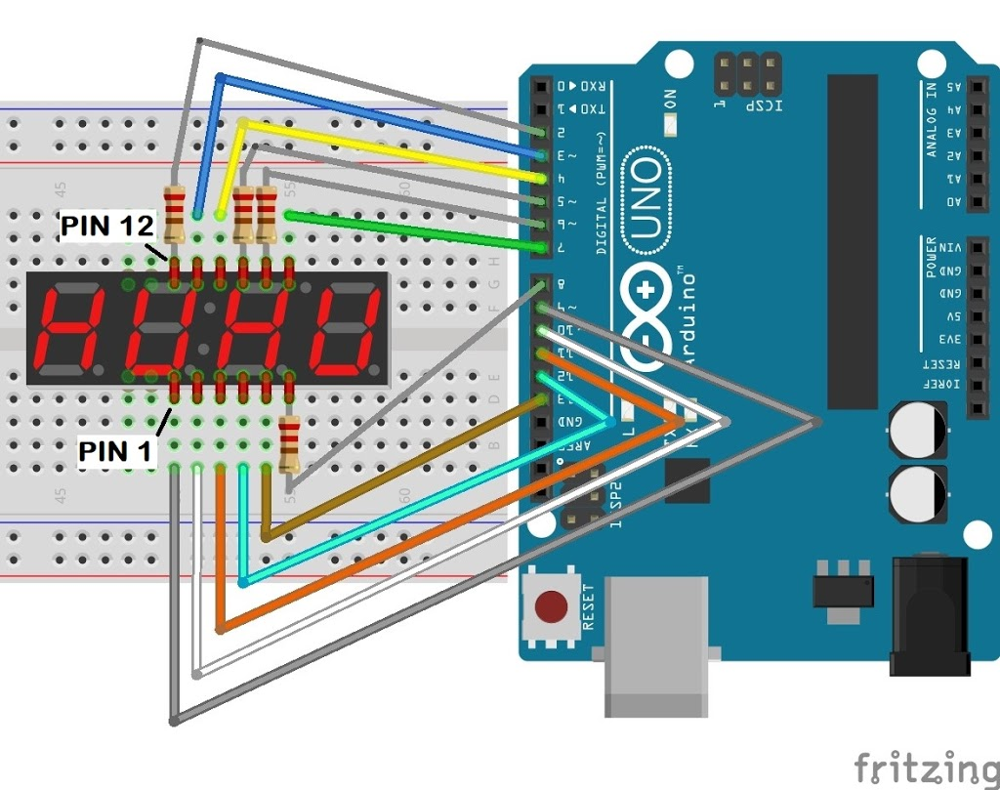

# Arduino thermometer with 4 digit 7 segment display

## Arduino UNO

Before uploading your code to the Arduino, make sure [DHTLib.zip](DHTLib.zip) is installed in your IDE ([tutorial](https://www.arduino.cc/en/guide/libraries))

## 7 segment display: <u>HS420361K-32</u>

Based on: https://theokelo.co.ke/how-to-get-your-hs420361k-32-4-digit-7-segment-display-working-with-an-arduino/

### Wiring

## Temperature (and humidity) sensor: <u>DHT11</u>

Based on: https://www.circuitbasics.com/how-to-set-up-the-dht11-humidity-sensor-on-an-arduino/

### Wiring (DHT11 with 3 pins)

Signal pin (S) to Analog 0 (A0) on Arduino

Vcc (+) to 5V

Ground (-) to GND

**Warning:** if you have 4 pins on your DHT11 follow the tutorial above (needs 10K resistor between Vcc and Signal)